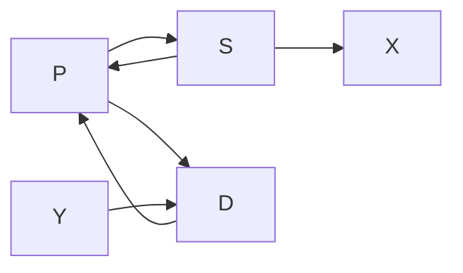

---
tags:
  - Python
---
### 含变量矩阵

```python
from sympy import symbols, Matrix

a, b = symbols('a b')
A = Matrix([[1, a], 
            [0, b]])
```

### 经济传导变量图

```python
from sympy import symbols, Matrix

α, β, γ ,ρ= symbols('α, β, γ ,ρ',positive=True)

matrix_data = [
    [0, α, -β, 0, 0],
    [-1/(α + β), 0, 0, -ρ, 0],
    [1/(α + β), 0, 0, 0, 0],
    [0, 0, 0, 0, 0],
    [0, 0, γ, 0, 0]
]

M = Matrix(matrix_data)

variable_list = ['P','S','D','X','Y']
variables = {name: i for i, name in enumerate(variable_list)}

variables

M[variables['P'],variables['S']]
```



为矩阵添加变量名行列标签：

```python
import pandas as pd

df = pd.DataFrame(M.tolist(), columns=variable_list, index=variable_list)
```

```python
from sympy import symbols, Matrix
import sympy

α, β= symbols('α, β')

matrix_data = [
    [0, α, -β, 0, 0],
    [0, 0, 0, 0, 0],
    [0, 0, 0, 0, 0],
    [-1/(α + β), 1, 0, 0, 0],
    [1/(α + β), 0, 1, 0, 0]
]

M = Matrix(matrix_data)

variable_list = ['P','S','D','Se','De']
variables = {name: i for i, name in enumerate(variable_list)}
```

### IndexedBase 添加

```python
A[A[1].indices+(1,)]
```